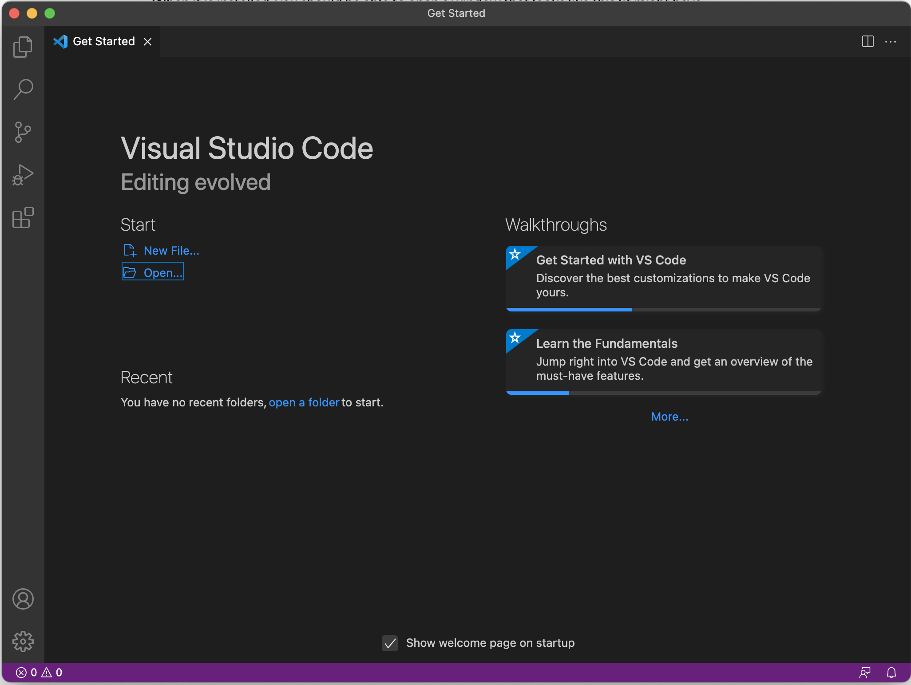
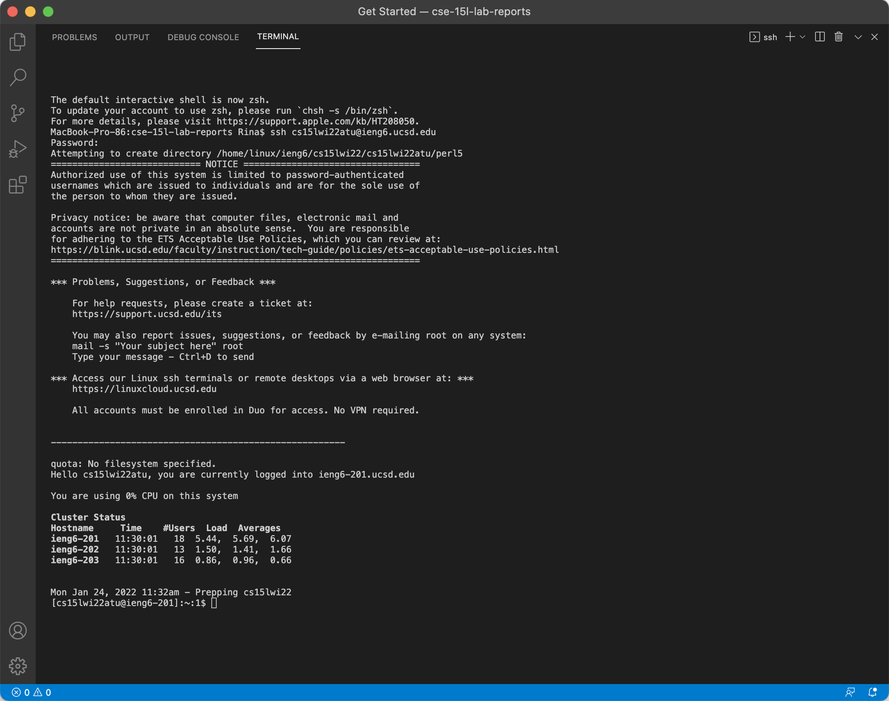
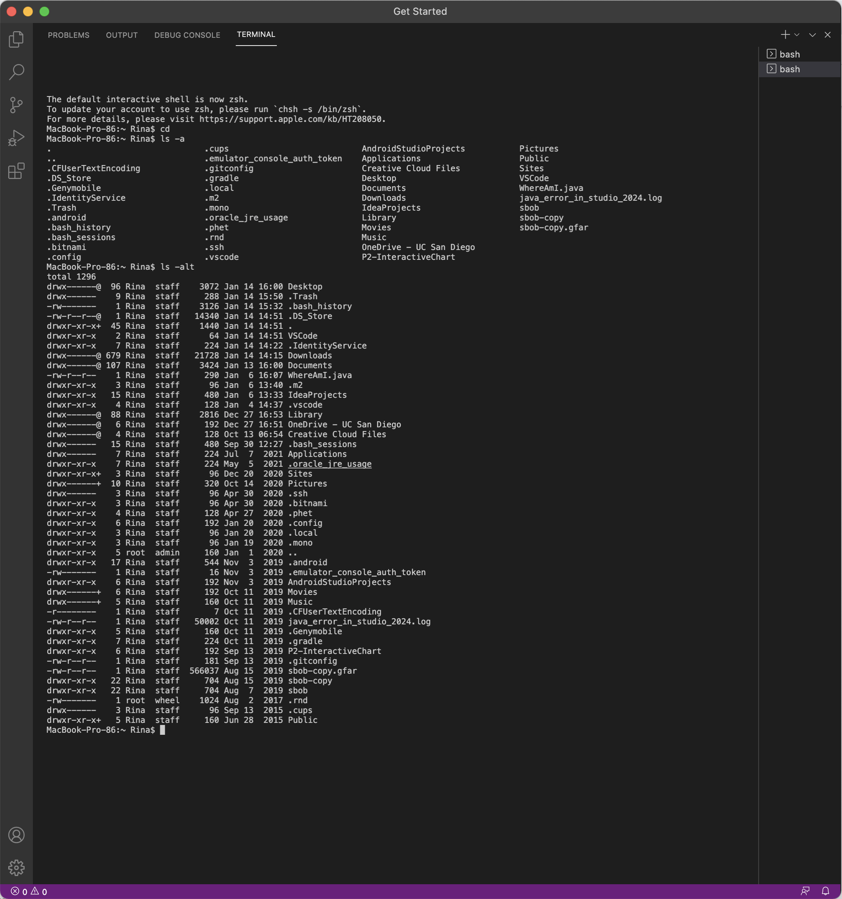

[Lab Report 1](https://rinakaura.github.io/cse-15l-lab-reports/lab-report-1-week-2.html)

Installing VScode
- Click on this link: [Link](https://code.visualstudio.com/)
- Download VSCode onto your computer.
- When installed, you should end up with a screen like this:

---
Remotely Connecting
- Open a terminal in VSCode by clicking Terminal > New Terminal on the Apple Bar
- Type this command: $ ssh cs15lwi22atu@ieng6.ucsd.edu, and replace atu with the letters in your account name
- Enter your password when prompted and you should receive the following text:

---
Trying Some Commands
- Open a terminal in VSCode
- Try some of the following commands
> $ cd
> 
> $ cd ~
> 
> $ ls
> 
> $ ls -a
> 
> $ ls -alt
> 
> $ cp /home/linux/ieng6/cs15lwi22/public/hello.txt ~/
> 
> $ cat /home/linux/ieng6/cs15lwi22/public/hello.txt
> 
- Here's what some of the commands should look like:

---
Moving Files with scp
- Type $ scp filename.java cs15lwi22atu@ieng6.ucsd.edu:~/
- Enter your password
- Log into ieng6 and see your file
---
Setting an SSH Key
- Type $ ssh-keygen
- Copy the public key on the id_rsa.pub file from the .ssh directory on your computer
---
Optimizing Remote Running
- 
