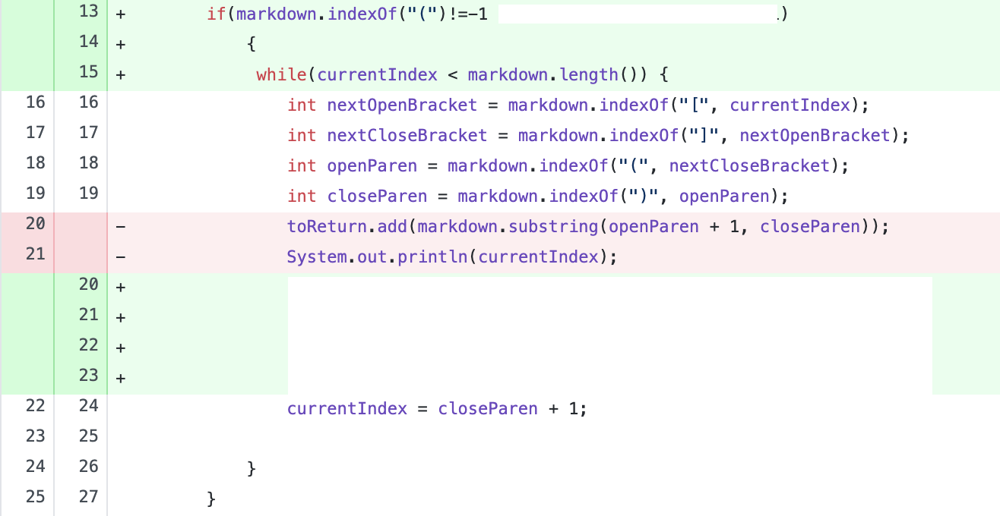
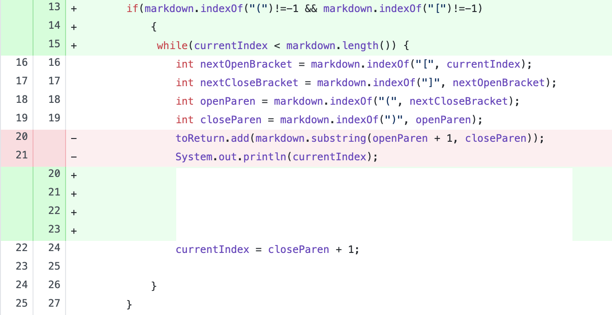
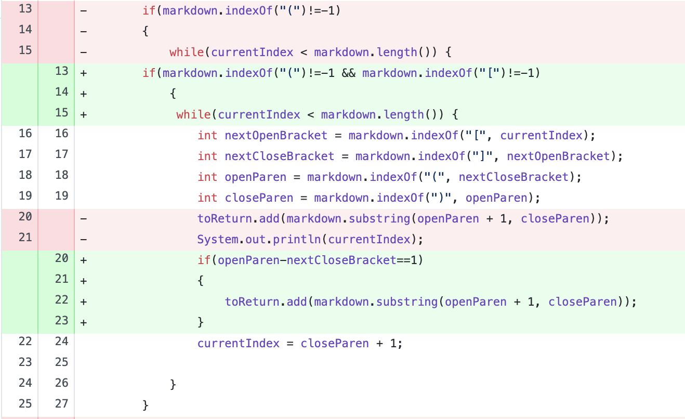

## Change 1

[Test-file](test-file-filler.md)

This file contains a link without parentheses (failure-inducing input), so MarkdownParse should have returned an empty array, given that the link was not formatted properly. Instead, MarkdownParse returned a StringIndexOutOfBoundsException (symptom). We found that the cause of the symptom was that the .indexOf() function returned -1 because it could not find the opening parenthesis (bug), so we added an if statement to ensure that the code would only search for a link if the markdown file had an opening parentheses.

---
## Change 2

[Test-file](test-file-filler.md)

This file contains a link without parentheses (failure-inducing input), so MarkdownParse should have returned an empty array, given that the link was not formatted properly. Instead, MarkdownParse returned a StringIndexOutOfBoundsException (symptom). We found that the cause of the symptom was that the .indexOf() function returned -1 because it could not find the opening parenthesis (bug), so we added an if statement to ensure that the code would only search for a link if the markdown file had an opening parentheses.

---
## Change 3

[Test-file](test-file-filler.md)

This file contains a link without parentheses (failure-inducing input), so MarkdownParse should have returned an empty array, given that the link was not formatted properly. Instead, MarkdownParse returned a StringIndexOutOfBoundsException (symptom). We found that the cause of the symptom was that the .indexOf() function returned -1 because it could not find the opening parenthesis (bug), so we added an if statement to ensure that the code would only search for a link if the markdown file had an opening parentheses.
