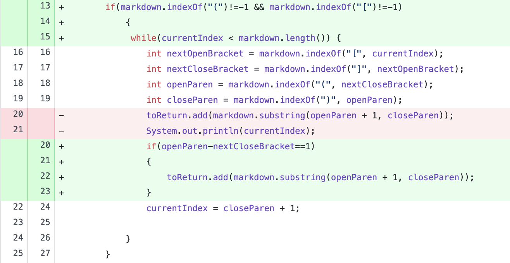

# Lab Report 2

_Note: The changes in the Markdown repository where not committed until the file was fully edited, so some improvisation was needed for the code change diff and symptom images. _

## Change 1

[Test-file with no parentheses](woohoo.md)

Symptom:

This file contains a link without parentheses (failure-inducing input), so MarkdownParse should have returned an empty arraylist, given that the link was not formatted properly. Instead, MarkdownParse returned a StringIndexOutOfBoundsException (symptom). We found that the cause of the symptom was that the .indexOf() function returned -1 because it could not find the opening parenthesis (bug), so we added an if statement to ensure that the code would only search for a link if the markdown file had an opening parentheses.

---
## Change 2

[Test-file with no brackets](ms.md)

Symptom:

This file contains a link without brackets (failure-inducing input), so MarkdownParse should have returned an empty arraylist, given that the link was not formatted properly. Instead, MarkdownParse returned the given link (symptom). We found that the cause of the symptom was that the code still looked for the link, regardless of whether brackets were present or not (bug), so we added an if statement to ensure that the code would only search for a link if the markdown file had an opening bracket.

---
## Change 3

[Test-file with spacing](cs1.md)

Symptom:

This file contains a link with a large space between the link tag and the parentheses with the link (failure-inducing input), so MarkdownParse should have returned an empty arraylist, given that the link was not formatted properly. Instead, MarkdownParse returned the given link (symptom). We found that the cause of the symptom was that the code did not account for the presence of spaces (bug), so we added an if statement around toReturn.add() to ensure that the code would only add a link to the arraylist if there was no space between the closing bracket and open parentheses.
