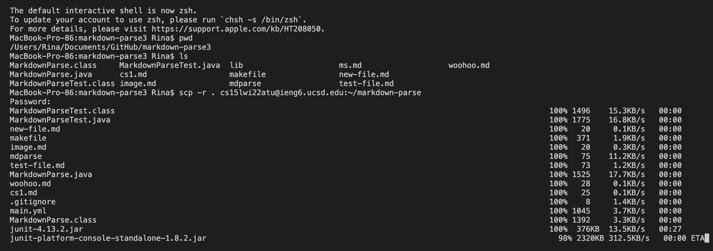
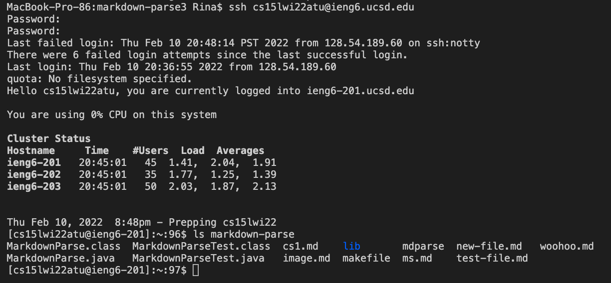

# Lab Report 3

## Copy whole directories with scp -r

First, check that you're in the markdown-parse directory
```
$ cd markdown-parse
$ pwd
/Users/you/src/markdown-parse
$ ls
MarkdownParse.java    
MarkdownParseTest.java
lib
all-test-files.md
```
Then, use scp to copy the entire markdown-parse directory.
```
$ scp -r . cs15lwi22@ieng6.ucsd.edu:~/markdown-parse
```


---
Now, use ssh to log in to your ieng6 account and see all the files 
```
$ ssh cs15lwi22zz@ieng6.ucsd.edu
$ ls markdown-parse
MarkdownParse.java    
MarkdownParseTest.java
lib
all-test-files.md
```



---
Show (like in the last step of the first lab) combining scp, ;, and ssh to copy the whole directory and run the tests in one line.
