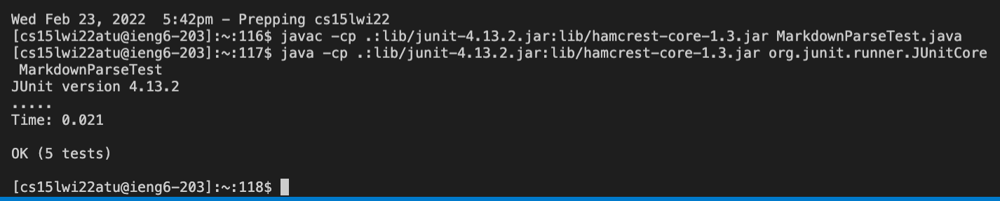
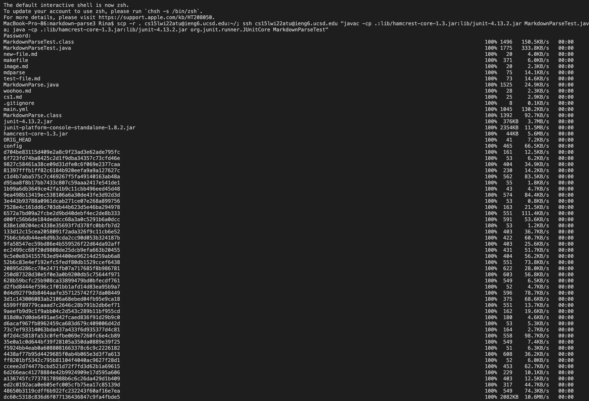
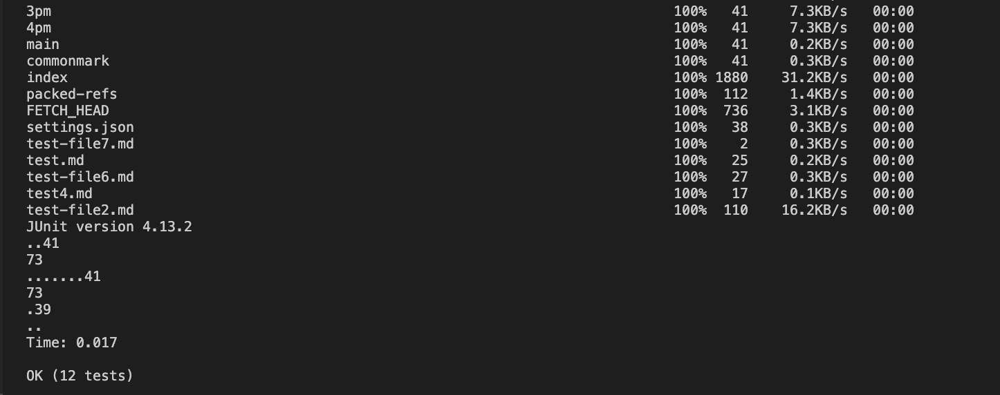

# Lab Report 3

## Copy whole directories with scp -r


First, check that you're in the markdown-parse directory
```
$ cd markdown-parse
$ pwd
/Users/you/src/markdown-parse
$ ls
MarkdownParse.java    
MarkdownParseTest.java
lib
all-test-files.md
```
Then, use scp to copy the entire markdown-parse directory.
```
$ scp -r . cs15lwi22@ieng6.ucsd.edu:~/markdown-parse
```


---
Now, use ssh to log in to your ieng6 account, see all the files, and run your tests using the following commands
```
$ ssh cs15lwi22zz@ieng6.ucsd.edu
$ ls markdown-parse
$ javac -cp .:lib/junit-4.13.2.jar:lib/hamcrest-core-1.3.jar MarkdownParseTest.java 
$ java -cp .:lib/junit-4.13.2.jar:lib/hamcrest-core-1.3.jar org.junit.runner.JUnitCore MarkdownParseTest
```




---
You can complete this whole process and run all MarkdownParseTest tests by typing the following command:
```
$ scp -r . cs15lwi22zz@ieng6.ucsd.edu:~/markdown-parse; javac -cp .:lib/junit-4.13.2.jar:lib/hamcrest-core-1.3.jar MarkdownParseTest.java; java -cp .:lib/junit-4.13.2.jar:lib/hamcrest-core-1.3.jar org.junit.runner.JUnitCore MarkdownParseTest
```



