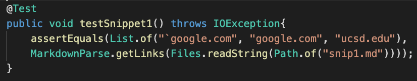
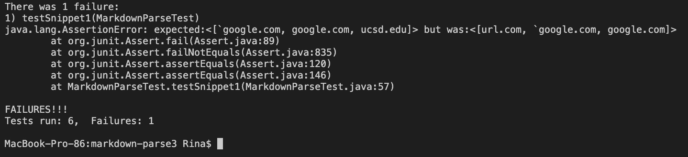
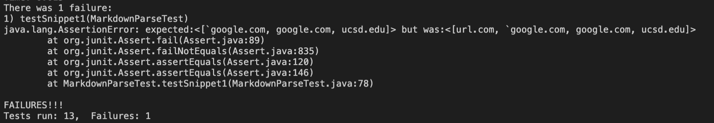
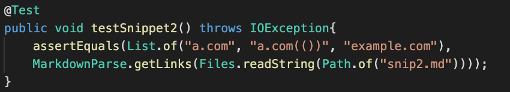
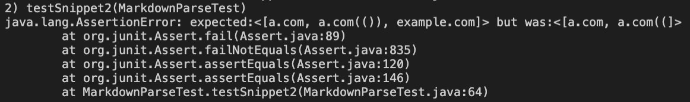
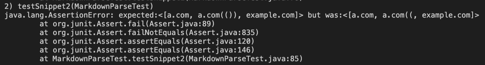
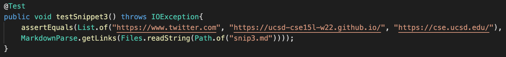
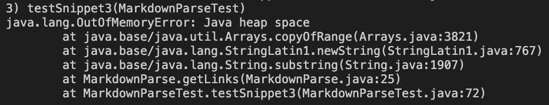
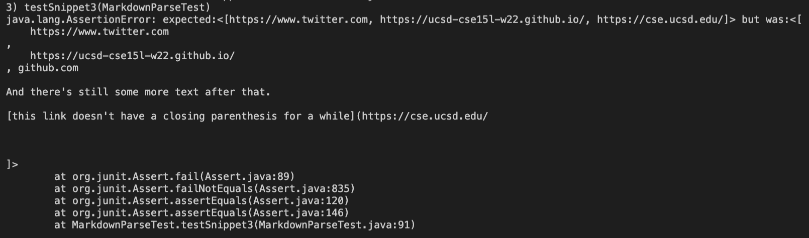

# Lab Report 4
---
## Repository Links
- [My markdown-parse](https://github.com/rinakaura/markdown-parse)

- [Reviewed markdown-parse](https://github.com/Darrengn/markdown-parse)

---
## Snippet 1

According to VSCode Preview, this file should produce `google.com, google.com, and ucsd.edu. The first line should not be a valid link.

Test:



JUnit output for my markdown-parse(failure):



JUnit output for reviewed markdown-parse(failure):



---
## Snippet 2

According to VSCode Preview, this file should produce a.com, a.com(()), and example.com.

Test:



JUnit output for my markdown-parse(failure):



JUnit output for reviewed markdown-parse(failure):



---
## Snippet 3

According to VSCode Preview, this file should produce https://www.twitter.com, https://ucsd-cse15l-w22.github.io/, and https://cse.ucsd.edu/.

Test:



JUnit output for my markdown-parse(failure):



JUnit output for reviewed markdown-parse(failure):



---

Do you think there is a small (<10 lines) code change that will make your program work for snippet 1 and all related cases that use inline code with backticks? If yes, describe the code change. If not, describe why it would be a more involved change.
```
Yes, I think there is a small code change that could account for backticks. This seems to only be an issue if one or both of the brackets are in between two backticks. Adding a block of code that gets the indices for backticks and pushes the search for nextOpenBracket along if one or more of a link's brackets are in between two backticks should make the program work.
```

Do you think there is a small (<10 lines) code change that will make your program work for snippet 2 and all related cases that nest parentheses, brackets, and escaped brackets? If yes, describe the code change. If not, describe why it would be a more involved change.
```
No, I think these types of cases will require a method of its own that's more than 10 lines. It's hard to code which parentheses and brackets to regard vs disregard. Accounting for all possible edge cases will take more than 10 lines.
```

Do you think there is a small (<10 lines) code change that will make your program work for snippet 3 and all related cases that have newlines in brackets and parentheses? If yes, describe the code change. If not, describe why it would be a more involved change.
```
No, I don't think any size of code change will make my program work for snippet 3. I would have to increase the heap size through command line.
```
