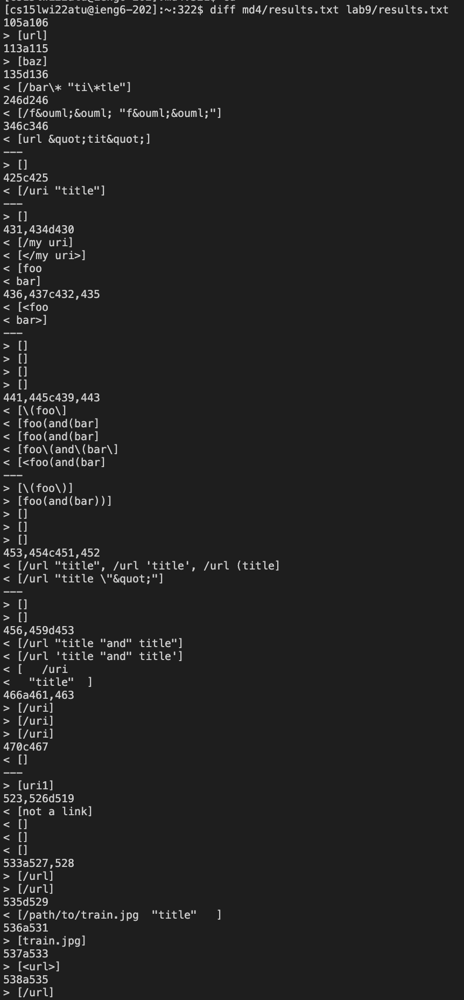
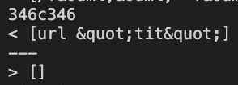
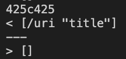

# Lab Report 5
---
## Tests With Different Results
- To find the tests with different results, I cd'ed into my markdown-parse directory (named 'md4') and directed the bash output to a file called results.txt, then repeated those steps for the lab 9 markdown-parse directory (named 'lab9'). After that, I used diff to find the tests with different outputs. The commands were as follows:
```
$ cd md4
$ bash script.sh > results.txt
$ cd
$ cd lab9
$ bash script.sh > results.txt
$ cd
$ diff md4/results.txt lab9/results.txt
```

The results from diff were as follows:


## Test 1


## Test 2


For each test:
Describe which implementation is correct, or if you think neither is correct, by showing both actual outputs and indicating what the expected output is.
For the implementation that’s not correct (or choose one if both are incorrect), describe the _bug (the problem in the code). You don’t have to provide a fix, but you should be specific about what is wrong with the program, and show the code that should be fixed.
