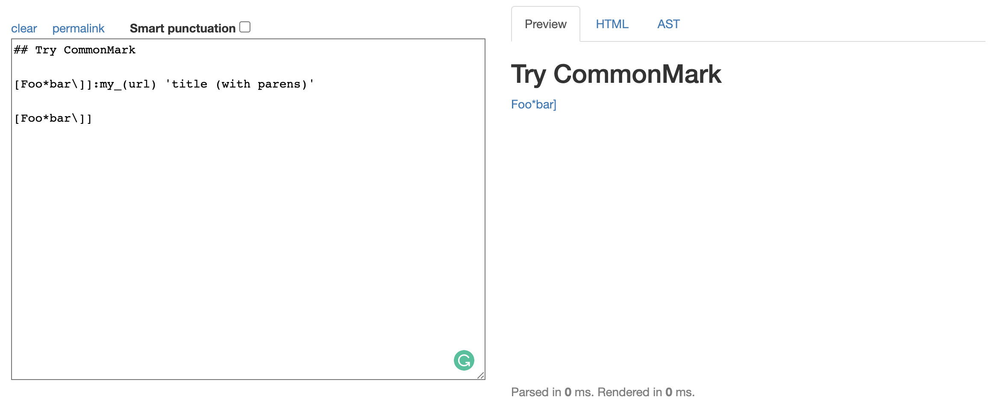

# Lab Report 5
---
## Tests With Different Results
- To find the tests with different results, I cd'ed into my markdown-parse directory (named 'md4') and directed the bash output to a file called results.txt, then repeated those steps for the lab 9 markdown-parse directory (named 'lab9'). After that, I used diff to find the tests with different outputs. The commands were as follows:
```
$ cd md4
$ bash script.sh > results.txt
$ cd
$ cd lab9
$ bash script.sh > results.txt
$ cd
$ diff md4/results.txt lab9/results.txt
```

The results from diff were as follows:


## Test 1: 194.md


Difference on line 212 of the results.txt files which corresponds with 194.md


My Output: []

The Professor's Output: [url]

### Expected Output

To find the expected output, I typed the following commands to see the contents of 194.md. 
```
$cd test-files
$cat 194.md
```
Then, I pasted the contents into the [Commonmark Parser](https://spec.commonmark.org/dingus/) and looked at the HTMl tab to find the link destination.




Expected Output: [my_(url)]

Neither markdown-parse directory produced the correct output.

### Finding the Bug

Since both outputs were wrong, I looked at my markdown-parse directory first. From toggling with the md file, I found that that the specific combination of '\]]:' is what makes 'my_(url)' a valid link. In the following code, this combination of characters is not accounted for. In order to fix this bug, we can add an if statement before the indicated block of code that searches for '\]]:', adds the link that follows to toReturn, and then moves currentIndex to the end of the link.


Next, I looked at the lab 9 markdown-parse directory and found that it had the same issue as my markdown-parse directory, where '\]]:' was not accounted for.
Within the while loop, an if statement should be added above the red line that searches for '\]]:', adds the link that follows to toReturn, and then moves currentIndex to the end of the link.


## Test 2: 201.md


Difference on line 230 of the results.txt files which corresponds with 201.md


My Output: []

The Professor's Output: [baz]

### Expected Output

To find the expected output, I typed the following commands to see the contents of 201.md. 
```
$cd test-files
$cat 201.md
```
Then, I pasted the contents into the [Commonmark Parser](https://spec.commonmark.org/dingus/) and looked at the HTMl tab to find the link destination.


Expected Output: []

My markdown-parse directory produced the correct output, the lab 9 directory did not.

### Finding the Bug

Since the professor's output was wrong, I looked at the lab 9 MarkdownParse.java file. The issue with the code is that it did not account for space between the closed bracket and open parentheses, causing the file to display an incorrect output. In order to fix this bug, we can add an if statement after the indicated block of code that checks if the index of openParen is equal to the index of nextCloseBracket + 1, and continue the loop is its not.


